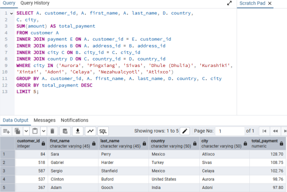

# Exercise 3.7 covered joining tables of data. Below are the instructions, SQL queries and outputs. 

##  Rockbuster’s management team would like to know the top 10 countries where Rockbuster customers are based so they can focus on building a better brand image in those markets.

### Step 1: Write a query to find the top 10 countries for Rockbuster in terms of customer numbers. 

#### Write a few sentences on how you approached this query and why.
My first step was to identify the information I was looking for and consult my ERD to also
identify the tables where it could be found (the customer and country tables. The next step was
to also identify the tables needed create the connections (address and city). Therefore, the
tables I needed to include are A. customer, B. address, C. city, and D. country. Visualizing them
laid out left to right helped to keep that organized in my mind and verify that a series of inner
joins would be the most efficient way to go. Then it was time to identify the keys between each
table: address_id, then city_id, then country_id. Obviously since I’m looking for the top 10
countries in terms of number of customers, I needed to group by country and order the count
of customer_id in descending order with a limit of 10 to avoid including unnecessary
information. 

### Step 2: Next, write a query to identify the top 10 cities that fall within the top 10 countries you identified in step 1.

#### Write a short explanation of how you approached this query and why.
Here I simply added to the query I had already written to identify the top 10 countries. I added
“city” to what I was selecting, and a WHERE clause with an IN operator to return data related
only to those top 10 countries. I then changed the grouping to be by both city and country to
get the correct aggregation. 

### Step 3: Now write a query to find the top 5 customers from the top 10 cities who’ve paid the highest total amounts to Rockbuster. The customer team would like to reward them for their loyalty!

#### Explain how you approached this query.
Again, I modified what I already had in my query tool, adding the connection to the payment
table and including the additional required columns requested for the final output within my
“select” list. I changed the WHERE clause to look at the top 10 cities, and updated the group by,
order by and limit. 
