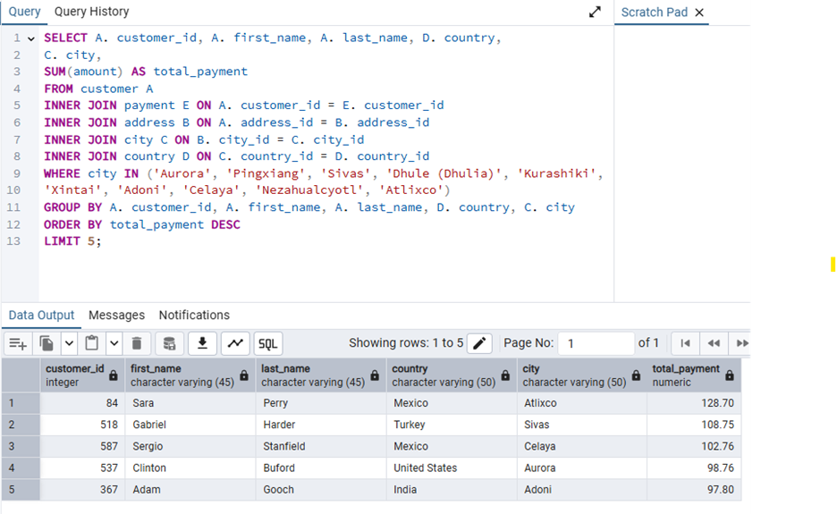
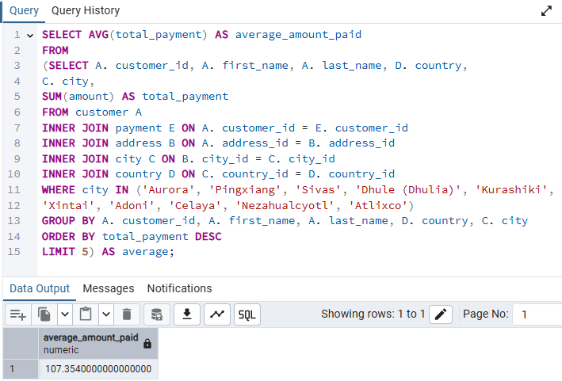
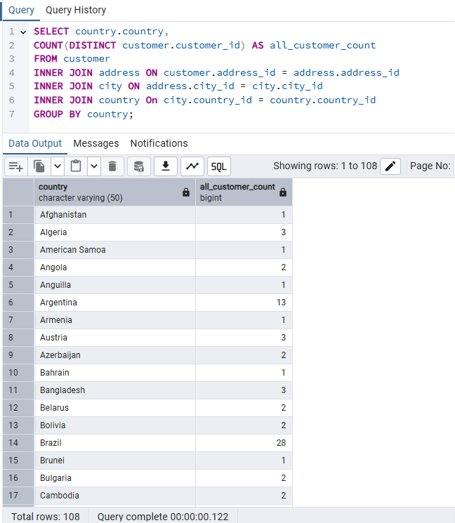
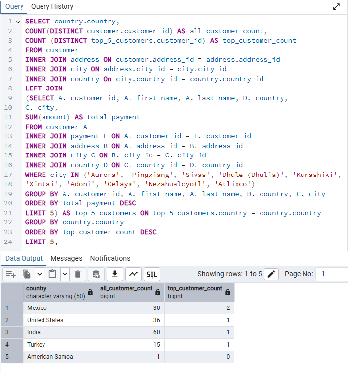

# Exercise 3.8 covered performing subqueries. Below you'll find the instructions, SQL queries and outputs. 

## Now your manager wants you to analyze the results of that query. The only catch is that revising your query could take quite some time, not to mention the risk of breaking it. Instead, you decide to use it as a subquery (or inner query) to answer the business questions listed in the task.

### Step 1:  Find the average amount paid by the top 5 customers.
#### Copy the query you wrote in step 3 of the task from Exercise 3.7: Joining Tables of Data into the Query Tool. This will be your subquery, so give it an alias, “total_amount_paid,” and add parentheses around it. 
#### Write an outer statement to calculate the average amount paid.

#### Subquery: 

#### Both: 

### Step 2: Find out how many of the top 5 customers you identified in step 1 are based within each country.
#### Copy the query from step 3 of task 3.7 into the Query Tool and add parentheses around it. This will be your inner query.
#### Write an outer statement that counts the number of customers living in each country. You’ll need to refer to your entity relationship diagram or data dictionary in order to do this. The information you need is in different tables, so you’ll have to use a JOIN. To get the count for each country, use COUNT(DISTINCT) and GROUP BY. Give your second column the alias “all_customer_count” for readability.
#### Place your inner query in the outer query. Since you want to merge the entire output of the outer query with the information from your inner query, use a left join to connect the two queries on the “country” column. You’ll need to add a LEFT JOIN after your outer query, followed by the subquery in parentheses.
#### Give your subquery an alias so you can refer to it in your outer query, for example, “top_5_customers”.

#### Outer Statement: 

#### Inner & Outer Statements; 

