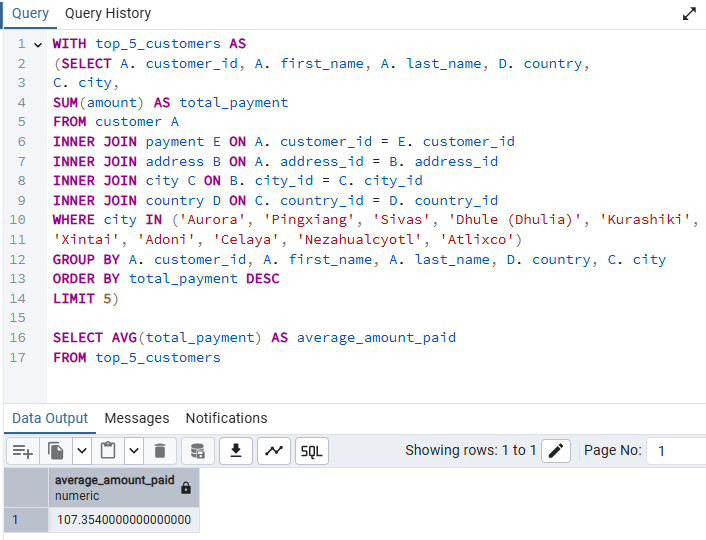
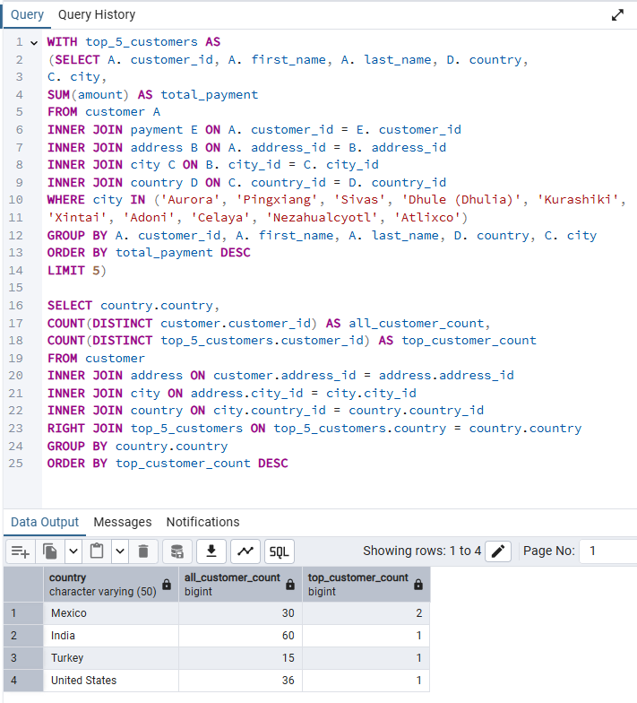

# Exercise 3.9 covered Common Table Expressions (CTEs). The task was to answer the business questions posed in the Exercise 3.8 using CTEs (as opposed to subqueries).

### Find the average amount paid by the top 5 customers.

### Find out how many of the top 5 customers you identified in step 1 are based within each country.

